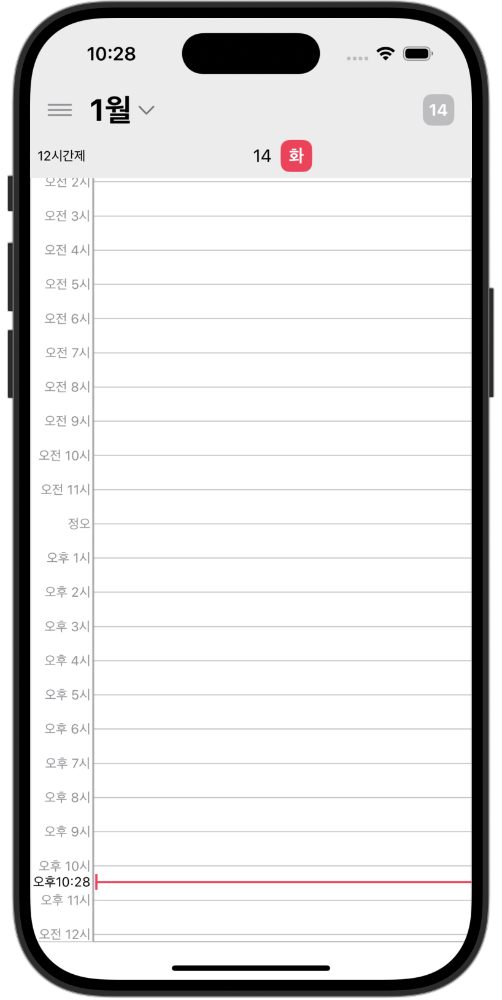
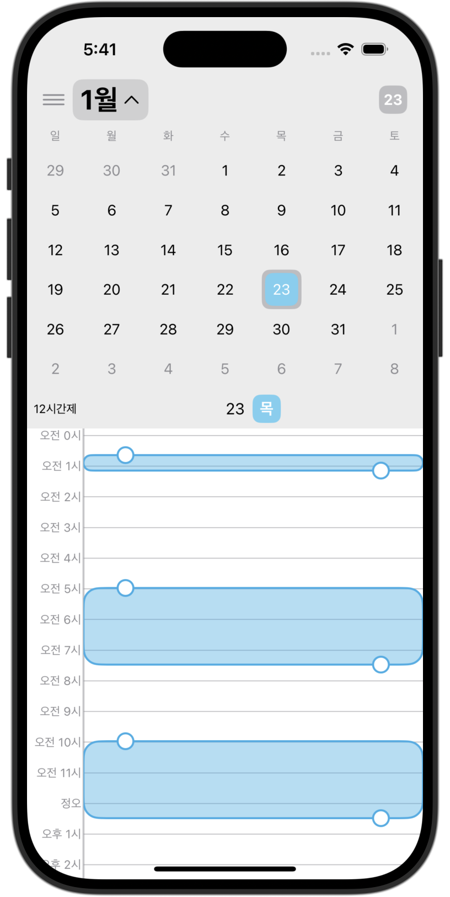
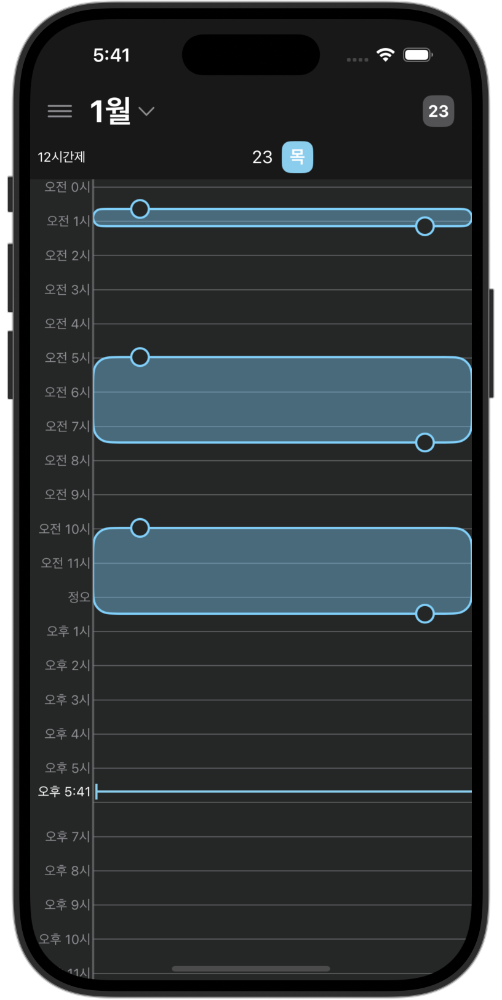
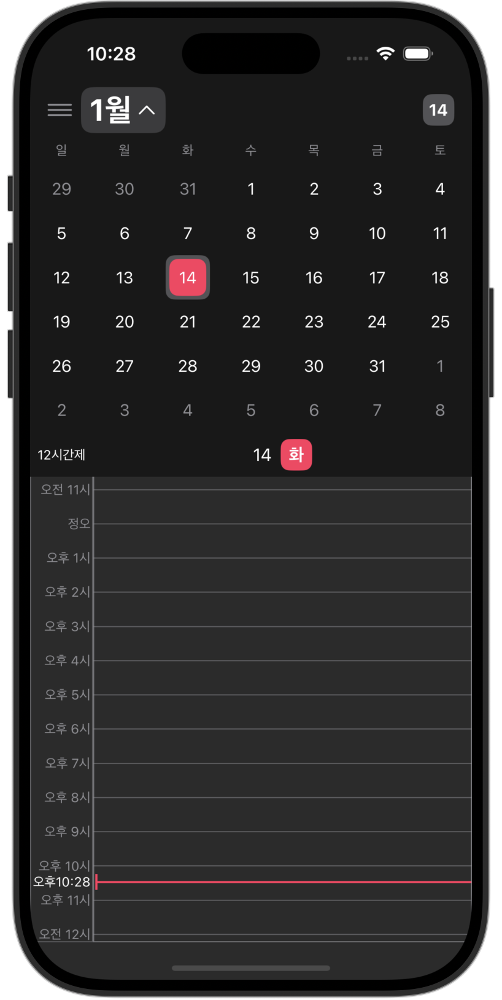

# SnapPlan

**기존 캘린더에 사진, 위치 정보를 포함한 지도, 음성 메모까지 추가할 수 있는 캘린더 확장판**

- **사용된 패턴**
    - MVVM

## 최소 iOS 버전
- iOS 16

## 특징
- Firestore를 통한 사용자 데이터 저장
- FirebaseAuth를 통한 사용자 인증
- Combine을 사용해 현재 시각을 0.1초 단위로 최신화
- frame 측정에 대한 GeometryReader 사용 최소화
- 라이트 / 다크 모드 지원
- 사용자의 드래그, 스크롤 모션에 대한 애니메이션 구현

## 앱 화면
<table>
  <tr>
    <td align="center" width="200px">
      
      
      <p><strong>라이트 모드</strong></p>
    </td>
    <td align="center" width="200px">
      
      
      <p><strong>다크 모드</strong></p>
    </td>
  </tr>
</table>


## Firestore 구조
```
User (컬렉션)
│  
├── user1 (문서)  ⬅️ FirebaseAuth와 자동 연동
│   │  
│   ├── timeData (컬렉션)
│   │   ├── 2025-01-21 (문서)
│   │   │   ├── entries: [{id: ..., time: ..., timePeriod: ...}]
│   │   ├── 2025-01-22 (문서)
│   │  
│   ├── 12timeFmt: true / false (필드)
│  
├── user2 (문서)
│   ├── timeData (컬렉션)
│   │   ├── 2025-01-21 (문서)
│   │   ├── 2025-01-22 (문서)
│   │  
│   ├── 12timeFmt: true / false (필드)
```
