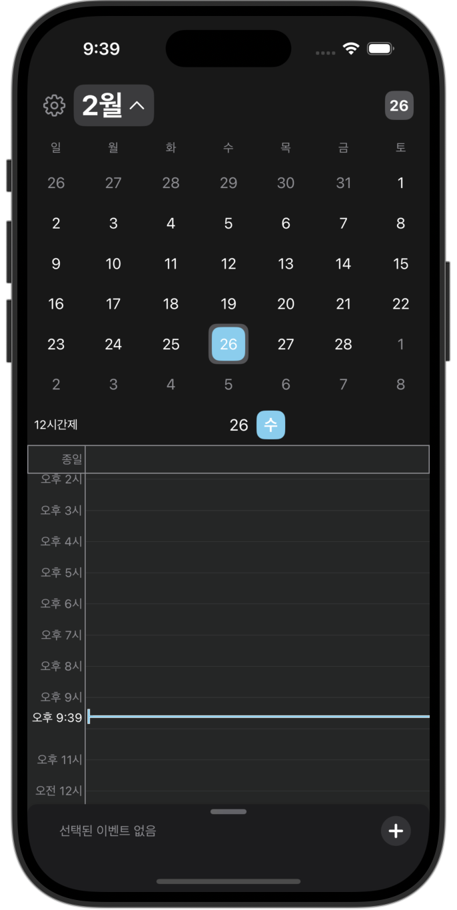
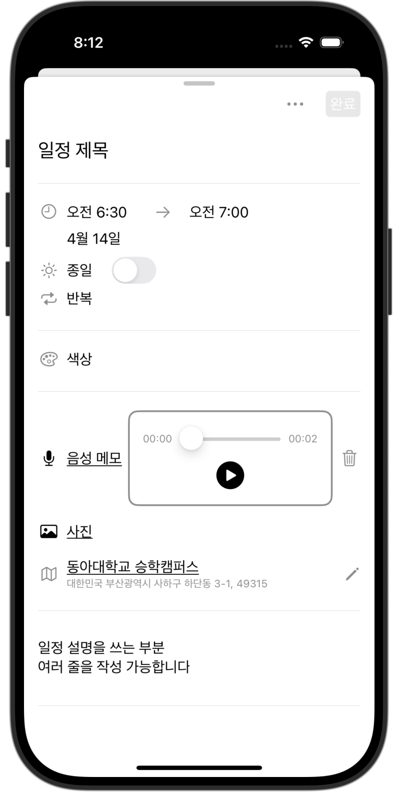
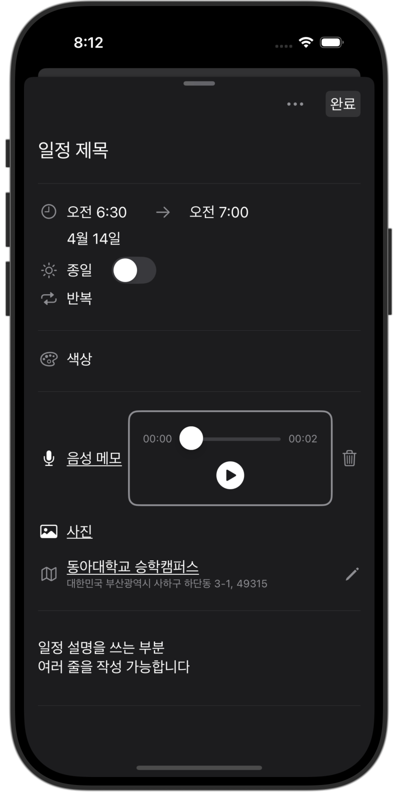

# SnapPlan

**기존 캘린더에 사진, 위치 정보를 포함한 지도, 음성 메모까지 추가할 수 있는 캘린더 확장판**

## 사용된 패턴
- MVVM

## 최소 iOS 버전
- iOS 16

## 특징
- 노션 캘린더를 베이스로 한 UI 구현
- FirebaseAuth를 통한 사용자 인증
- Firestore를 통한 사용자, 일정 데이터 저장
- Firebase Storage를 통한 사진, 음성 메모 저장
- Combine을 사용해 현재 시각을 0.1초 단위로 최신화
- frame 측정에 대한 GeometryReader 사용 최소화
- 라이트 / 다크 모드 지원
- 사용자의 드래그, 스크롤 모션에 대한 애니메이션 구현

## 앱 화면
<table>
  <tr>
    <td align="center" width="250px">
      
      <p><strong>로그인 (라이트 모드)</strong></p>
    </td>
    <td align="center" width="250px">
      
      <p><strong>로그인 (다크 모드)</strong></p>
    </td>
  </tr>
  <tr>
    <td align="center" width="250px">
      
      <p><strong>메인 화면 (라이트 모드)</strong></p>
    </td>
    <td align="center" width="250px">
      
      <p><strong>메인 화면 (다크 모드)</strong></p>
    </td>
  </tr>
  <tr>
    <td align="center" width="250px">
      
      <p><strong>캘린더 확장 (라이트 모드)</strong></p>
    </td>
    <td align="center" width="250px">
      
      <p><strong>캘린더 확장 (다크 모드)</strong></p>
    </td>
  </tr>
  <tr>
  <td align="center" width="250px">
    
    <p><strong>스케줄 추가 (라이트 모드)</strong></p> 
  </td>
  <td align="center" width="250px">
    
    <p><strong>스케줄 추가 (다크 모드)</strong></p> 
  </td>
  </tr>
</table>


## Firebase 구조
```
📁 Firestore  
├── 📂 Users Collection  
│   ├── 📄 {userId}/info  
│   │   ├── uid: 사용자 ID  
│   │   ├── displayName: 사용자 닉네임  
│   │   ├── email: 사용자 이메일  
│   │   ├── is12TimeFmt: 12시간제 포맷 여부  
│   │   ├── screenMode: 화면 모드 (ex. unspecified)  
│   │   └── signedAt: 가입 시간 (Firestore 서버 타임스탬프)  
│  
├── 📂 Schedules Collection  
│   ├── 📂 {userId}/schedules/data  
│   │   ├── 📄 {scheduleId}  
│   │   │   ├── title: 일정 제목  
│   │   │   ├── startDate: 일정 시작일  
│   │   │   ├── endDate: 일정 종료일  
│   │   │   ├── isAllDay: 종일 여부  
│   │   │   ├── cycleOption: 반복 주기  
│   │   │   ├── color: 일정 색상  
│   │   │   ├── location: 일정 위치  
│   │   │   ├── address: 일정 주소  
│   │   │   └── description: 일정 설명  
│  
📂 Firebase Storage  
├── 📂 Photos  
│   ├── 📂 /photos/{userId}/{scheduleId}/  
│   │   └── 📄 {photoId}.jpg  
│  
├── 📂 Voice Memos  
│   ├── 📂 /voiceMemos/{userId}/{scheduleId}/  
│   │   └── 📄 voiceMemo.m4a
```
