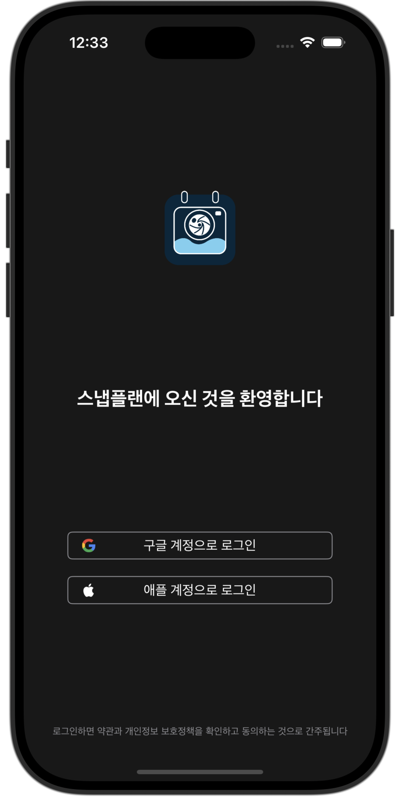

# SnapPlan

**기존 캘린더에 사진, 위치 정보를 포함한 지도, 음성 메모까지 추가할 수 있는 캘린더 확장판**

## 사용된 패턴
- MVVM

## 최소 iOS 버전
- iOS 16

## 특징
- 노션 캘린더를 베이스로 한 UI 구현
- Firestore를 통한 사용자 데이터 저장
- FirebaseAuth를 통한 사용자 인증
- Combine을 사용해 현재 시각을 0.1초 단위로 최신화
- frame 측정에 대한 GeometryReader 사용 최소화
- 라이트 / 다크 모드 지원
- 사용자의 드래그, 스크롤 모션에 대한 애니메이션 구현

## 앱 화면
<table>
  <tr>
    <td align="center" width="250px">
      
      <p><strong>로그인 (라이트 모드)</strong></p>
    </td>
    <td align="center" width="250px">
      
      <p><strong>로그인 (다크 모드)</strong></p>
    </td>
  </tr>
  <tr>
    <td align="center" width="250px">
      
      <p><strong>메인 화면 (라이트 모드)</strong></p>
    </td>
    <td align="center" width="250px">
      
      <p><strong>메인 화면 (다크 모드)</strong></p>
    </td>
  </tr>
  <tr>
    <td align="center" width="250px">
      
      <p><strong>캘린더 확장 (라이트 모드)</strong></p>
    </td>
    <td align="center" width="250px">
      
      <p><strong>캘린더 확장 (다크 모드)</strong></p>
    </td>
  </tr>
  <tr>
  <td align="center" width="250px">
    
    <p><strong>스케줄 추가 (라이트 모드)</strong></p> 
  </td>
  <td align="center" width="250px">
    
    <p><strong>스케줄 추가 (다크 모드)</strong></p> 
  </td>
  </tr>
</table>


## Firestore 구조
```
User UID (컬렉션) ⬅️ FirebaseAuth와 연동
│
├── info (문서)
│   ├── displayName: String
│   ├── email: String
│   ├── is12TimeFmt: Bool
│   ├── signedAt: TimeStamp
│   └── User UID: String
│
└── scheduleData (문서)
    ├── yyyy-MM-dd (서브 컬렉션) ⬅️ 일정이 시작되는 날짜
    │   ├── UUID().uuidString (문서)
    │   │   ├── color: Int
    │   │   ├── cycleOption: String
    │   │   ├── description: String
    │   │   ├── location: String
    │   │   ├── timeLine: [TimeStamp]
    │   │   └── title: String
```
