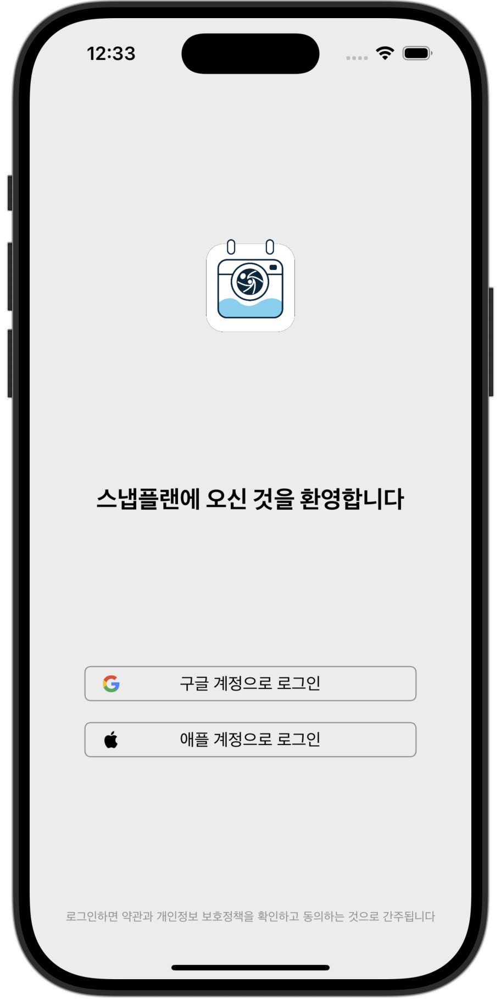
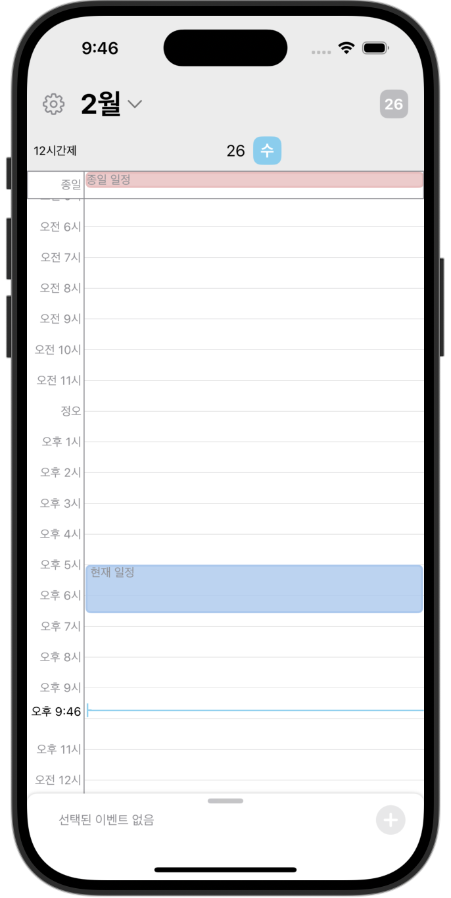
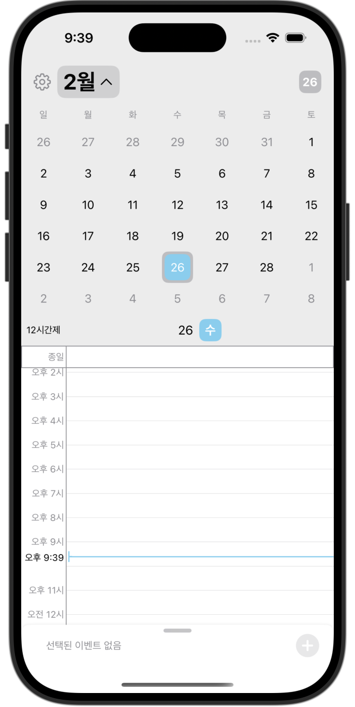

# SnapPlan

**기존 캘린더에 사진, 위치 정보를 포함한 지도, 음성 메모까지 추가할 수 있는 캘린더 확장판**

- **사용된 패턴**
    - MVVM

## 최소 iOS 버전
- iOS 16

## 특징
- Firestore를 통한 사용자 데이터 저장
- FirebaseAuth를 통한 사용자 인증
- Combine을 사용해 현재 시각을 0.1초 단위로 최신화
- frame 측정에 대한 GeometryReader 사용 최소화
- 라이트 / 다크 모드 지원
- 사용자의 드래그, 스크롤 모션에 대한 애니메이션 구현

## 앱 화면
<table>
  <tr>
    <td align="center" width="250px">
      
      <p><strong>로그인 (라이트 모드)</strong></p>
    </td>
    <td align="center" width="250px">
      
      <p><strong>로그인 (다크 모드)</strong></p>
    </td>
  </tr>
  <tr>
    <td align="center" width="250px">
      
      <p><strong>메인 화면 (라이트 모드)</strong></p>
    </td>
    <td align="center" width="250px">
      
      <p><strong>메인 화면 (다크 모드)</strong></p>
    </td>
  </tr>
  <tr>
    <td align="center" width="250px">
      
      <p><strong>캘린더 확장 (라이트 모드)</strong></p>
    </td>
    <td align="center" width="250px">
      
      <p><strong>캘린더 확장 (다크 모드)</strong></p>
    </td>
  </tr>
</table>


## Firestore 구조
```
User (컬렉션)
│  
├── user1 (문서)  ⬅️ FirebaseAuth와 자동 연동
│   │  
│   ├── ScheduleData (컬렉션)
│   │   ├── 2025-01-21 (문서)
│   │   │   ├── entries: [{
│   │   │   │       id: UUID,  ⬅️ 일정 ID
│   │   │   │       title: String,  ⬅️ 일정 제목
│   │   │   │       timeLine: { start: Date, end: Date },  ⬅️ 일정 시간 범위
│   │   │   │       isChanging: Boolean,  ⬅️ 일정 시간 변경 여부
│   │   │   │       cycleOption: String,  ⬅️ 일정 반복 주기
│   │   │   │       location: String,  ⬅️ 일정 장소
│   │   │   │       description: String,  ⬅️ 일정 설명
│   │   │   │       color: Int  ⬅️ 일정 색상 (Color 배열 인덱스)
│   │   │   │     }]
│   │   │       
│   │   ├── 2025-01-22 (문서)
│   │  
│   ├── 12timeFmt: true / false (필드)
│  
├── user2 (문서)
│   ├── ScheduleData (컬렉션)
│   │   ├── 2025-01-21 (문서)
│   │   ├── 2025-01-22 (문서)
│   │  
│   ├── 12timeFmt: true / false (필드)
```
